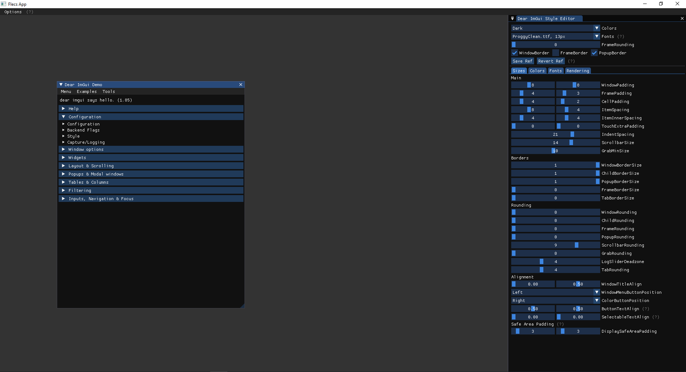

# Flecs Systems BGFX

This is a minimal example of a working bgfx system with flecs v2. It requires some of the flecs modules to run such as
[gui](https://github.com/flecs-hub/flecs-components-gui), [input](https://github.com/flecs-hub/flecs-components-input), and [sdl2](https://github.com/flecs-hub/flecs-systems-sdl2).
To manage BGFX with C it uses [bgfx.cmake](https://github.com/bkaradzic/bgfx.cmake)

For a fully working example of bgfx+imgui (docking branch) with CMake please refer to **bgfx_imgui** branch

## License
[MIT](https://choosealicense.com/licenses/mit/)
